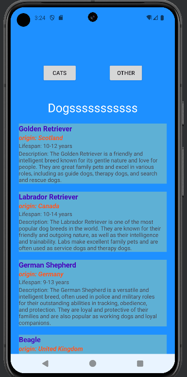

# FF-AndroidDevP4 Project

## Overview
FF-AndroidDevP4 is an Android application designed to display information about Cats and Dogs using two fragments in a single activity. The app fetches data from Free Test API using Retrofit and displays it in a RecyclerView. Each fragment contains a button that navigates to a second activity, passing some dummy data. The app also utilizes Android's DataStore for persistent data storage.

## Features
- **MainActivity with Two Fragments**:
  - **Cat Fragment**: Displays a list of cats with their name, origin, and description.
  - **Dog Fragment**: Displays a list of dogs with similar details.
- **Navigation**: Buttons in the fragments navigate to a secondary activity, passing dummy data.
- **RecyclerView**: Displays lists of cats and dogs fetched from an external API.
- **Data Fetching**: Uses Retrofit to fetch data from Free Test API.
- **Data Storage**: Utilizes Android's DataStore for storing and retrieving persistent data.
- **Edge-to-Edge Support**: Ensures the UI extends to the edges of the screen for a modern look.

## Technologies Used
- **Kotlin**: Primary programming language.
- **AndroidX**: Core libraries for Android development.
- **Retrofit**: HTTP client for making API requests.
- **RecyclerView**: For displaying lists.
- **ConstraintLayout**: For flexible and responsive UI design.
- **DataStore**: For modern data storage solution.

## DataStore Integration
DataStore is used for modern and asynchronous data storage, replacing SharedPreferences. It allows you to store key-value pairs and typed objects efficiently.

### Key Points
- **DataStore Setup**: Includes adding necessary dependencies and configuring the DataStore in the project.
- **Usage**: DataStore is integrated into the app to save and retrieve data asynchronously, ensuring a smooth and responsive user experience.


## How to Run the Project

1. **Clone the Repository**:
    ```sh
    git clone https://github.com/MuhammadWaleed-Animations/FF-AndroidDevP4.git
    ```
2. **Open in Android Studio**:
    - Launch Android Studio.
    - Select `File > Open...` and navigate to the project directory.
    - Click `OK` to open the project.

3. **Sync the Project**:
    - Android Studio should automatically sync the project. If not, click on `File > Sync Project with Gradle Files`.

4. **Set Up API Dependencies**:
    - Ensure you have the necessary dependencies in your `build.gradle` files. Retrofit, RecyclerView, ConstraintLayout, and DataStore should already be included.

5. **Run the App**:
    - Connect your Android device or start an Android emulator.
    - Click the `Run` button or select `Run > Run 'app'` from the menu.

## Screenshots
You can add up to three screenshots to illustrate the app's functionality. Here are placeholders for where you can add them:




## Additional Notes
- Make sure your internet connection is active to fetch data from the API.
- The project uses dummy data for navigation between activities. Customize as needed for your use case.

For more details, refer to the code documentation and comments within the project.

---

By following these steps, you should be able to set up and run the FF-AndroidDevP4 project on your local machine using Android Studio. Enjoy exploring the functionalities of this app!
